<!--
  ============================================================================
  README de perfil — sout-MMdev
  Paleta: grafite #0B1220 · ciano #22D3EE · azul #2563EB · texto #E2E8F0
  Os cards externos recebem essas cores nos parâmetros da URL, por isso o
  perfil inteiro parece um sistema só.
  ============================================================================
-->

<!-- ---------- BANNER (onda animada gerada pelo capsule-render) ---------- -->

<!-- ---------- TEXTO COM EFEITO DE DIGITAÇÃO ---------- -->

<!-- ---------- CONTATO + CONTADOR DE VISITAS ---------- -->

  
  
  

---

## Sobre mim

Construo aplicações web com **React** e **TypeScript** — de formulários multi-etapas a painéis
administrativos — cuidando desde a interface até a integração com o banco de dados.

- **Trabalhando agora em** um monorepo React + TypeScript com versões desktop e mobile compartilhando
  o mesmo núcleo de regras de negócio, e um CRM em React 19 conectado ao Supabase.
- **Aprofundando** em Node.js, PostgreSQL e arquitetura de front-end.
- **Cuido do detalhe**: dark mode por tokens de CSS, estados de carregamento e erro,
  e código comentado em português para o próximo que abrir o arquivo — inclusive eu.
- **Sou júnior e aprendo em público**: cada repositório aqui é um problema real que resolvi
  do começo ao fim.

---

## Stack

<!--
  skillicons.dev monta a faixa de ícones a partir da lista `i=`.
  Dois blocos: o que uso todo dia e o que estou aprofundando agora.
  Para incluir um ícone novo, basta acrescentar a sigla na lista — a lista
  completa de siglas está em https://skillicons.dev
-->

**No dia a dia**

**Aprofundando agora**

---

## Linguagens que domino

<!--
  Gráfico próprio (assets/linguagens.svg), gerado a partir da contagem real de
  linhas dos meus projetos.
  Usei este em vez do card automático de "top languages" por dois motivos:
  1. aquele card lê só repositórios públicos, e a maior parte do meu código
     ainda está em repositório privado — o resultado sairia distorcido;
  2. o serviço público que gera esses cards vive fora do ar (erro 503), e
     imagem quebrada no perfil é pior do que card nenhum.
  Para atualizar: recontar as linhas e ajustar os valores dentro do SVG.
-->

---

## Atividade

<!--
  ---------------------------------------------------------------------------
  CARDS DE ESTATÍSTICA — desativados de propósito
  ---------------------------------------------------------------------------
  Os cards de "GitHub Stats" e "Streak" (github-readme-stats / streak-stats)
  estão fora do ar na instância pública: respondem 503 por excesso de uso.
  Além disso, eles contam só o que é público — hoje isso apareceria como
  "0 estrelas / 0 seguidores", o que enfraquece o perfil em vez de ajudar.

  Para ligar quando fizer sentido, remova os comentários abaixo. Se o 503
  persistir, a solução recomendada pelos próprios projetos é subir uma
  instância própria no Vercel (leva poucos minutos e resolve o rate limit).

  

  
-->

---

## Projetos

<!--
  Feito à mão com badges do shields.io em vez dos cards "pin" do
  github-readme-stats, que estão respondendo 503.
  Para adicionar um projeto, copie um bloco e troque título, texto e badges.
-->

### Formulário comercial · monorepo desktop + mobile

Relatório comercial em React + TypeScript, com versões para computador e celular
compartilhando o mesmo núcleo de tipos e regras de negócio. Dark mode por tokens de CSS,
validação por etapa e envio integrado ao Supabase.

### CRM · painel administrativo

Painel em React 19 com autenticação, controle de acesso por perfil e leitura em tempo real
dos dados enviados pelo formulário. PostgreSQL no Supabase, com políticas de acesso por linha.

### [Projeto Sorteio](https://github.com/sout-MMdev/Projeto-sorteiro-)

Gerador de números aleatórios para sorteios. Foi onde coloquei em prática os primeiros
estudos de HTML, CSS e JavaScript.

<!-- ---------- RODAPÉ ---------- -->

